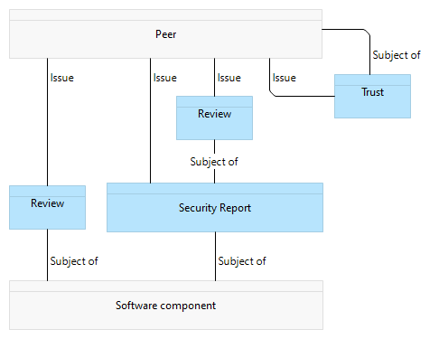
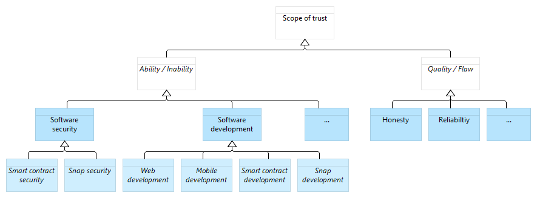
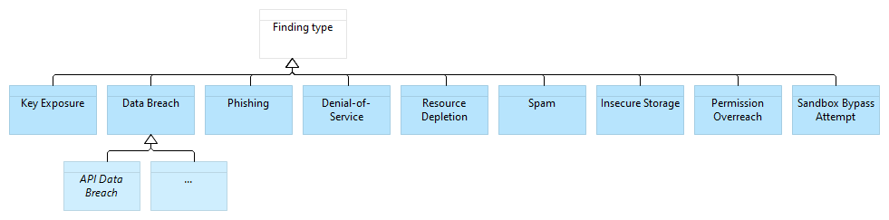

---
# Every document starts with a front matter in YAML enclosed by triple dashes.
# See https://jekyllrb.com/docs/front-matter/ to learn more about this concept.
caip: CAIP-261
title: Community-powered trust assessment in software components
author: Dayan | dayan.lens | dayksx.eth (@dayksx) <dayksx@protonmail.com>
discussions-to: <URL(s); if multiple, list separated by , without " or []> 
status: Draft
type: Standard
created: 2023-11-21
updated: 2023-11-21
requires (*optional): 
---

## Simple Summary

CAIP-x defines a way to assess trust in discreet resources (e.g. software components or packages) by leveraging community claims and pulling in trust data from social graphs and webs of trust.

## Abstract

This proposal introduces a standardized data framework with the aim to propose lightweight interfaces for:

1. claims made by actors in an open, peer-to-peer network about discreet resources (software components in all the examples that follow),
2. claims made by these actors about each other,
3. community-derived trust scores for the discreet resources and/or actors.

These three data elements can be used independently of one another.
For building a community-powered trust assessment mechanism, it's necessary to identify and gather the relevant data in accordance with the requirements of the intended trust scores computation.
These data can then be leveraged to compute synthetic trust scores which reflect the overall sentiment of the community.

The data framework modeled below incorporates the following basic primitives as inputs:

- **Trust List:** This allows individuals to define their trusted peers, shaping their trust graph;
- **Expert Report:** This enables experts to publish insights and conclusions about a given resource (e.g. an audit in the case of software components);
- **Peer Review:** This allows individuals to endorse or dispute claims made about resources by peers;
- **Trust Score:** This enables any trust computer to publish computed trust scores about resources and/or about the actors behind the other 3 primitives.

The peer-to-peer actor model described here operated on explicit trust signals, but is intended for contexts where actors are long-lived and public identifiers (such as a blockchain environment), such that trust assessments can be supplemented with more implicit on-chain and/or off-chain trust signals associated with its actors, such as `Proof of Humanity`, `Proof of Membership`, `Proof of Contributions`, `Proof of Attendences`, `Social Graphs`, and more.

While the trust-data input model is fairly general, the prototyping work to date has been focused on the software components associated with a blockchain-centric software environment, where actor identification and data formats tend to be relatively easy to connect into a graph.
Categories of discreet software resources we imagine this could be useful to describe include:

- self-custodial wallets (like MetaMask)
- wallet extensions (such as Snaps)
- decentralized network clients (for instance, Geth and other blockchain clients)
- smart contracts or other onchain compiled artefacts
- web-based decentralized applications for interacting with on-chain artefacts

## Motivation
<!--The motivation is critical for CAIP. It should clearly explain why the state of the art is inadequate to address the problem that the CAIP solves. CAIP submissions without sufficient motivation may be rejected outright.-->

Software components within a decentralized web tend to be distributed permissionlessly.
While this fosters permissionless innovation, it simultaneously exposes the system to potential vulnerabilities and scams, for lack of open trust and reputation mechanisms.
Most existing solutions for evaluating software components are centralized, necessitating trusted intermediaries.
This reliance on trusted intermediaries near the edges compromises the decentralized properties of the core of the ecosystem.
By standardizing data to form a universally applicable trust graph reusable across layers of the system, we strengthen the reliability of software components assessments powered by communities.

## Specification
<!--The technical specification should describe the standard in detail. The specification should be detailed enough to allow competing, interoperable implementations. -->
### Identification
Decentralized Identifiers ([DID](https://www.w3.org/TR/did-core/)) or Content Identifier (CID) are used to identify subjects such as peers, software components as well as the claims / assertions themselves.
They can also identify any issuers, which could be peers or a software entity like a trust computer.

Entities identifiers:
- **Peers:** Any key pair based DID such as `PKH` DID method (e.g. `did:pkh:eip155:1:<publicAddress>`, `did:pkh:bip122:<publicAddress>`, `did:pkh:solana:<publicAddress>`), `KEY` DID method, etc.;
- **Software components:** Custom identifiers for software components such as the checksum (e.g. `snap://<checksum>`, `did:pkh:eip155:1:<contractAddress>`);
- **Assertions:** CID generated based on their contents according to [RFC 8785
JSON Canonicalization Scheme (JCS)](https://www.rfc-editor.org/rfc/rfc8785);
- **Software entities:** `KEY` or `PKH` DID method.

A peer can issue assertions about the following subjects:

- Another peer, by issuing **Trust** assertions,
- A Software component, by issuing **Security Report** or **Review** assertions,
- A Security report, by issuing **Review** assertions.



#### Software component Trust Assessment Metamodel

All subsequent documents adhere to the [Verifiable Credential Data Model](https://www.w3.org/TR/vc-data-model/) for representation purposes.
However this standard does not prescribe any specific document type, even though internationally recognized standards are recommended.
The standard presumes that both the `issuer` property will be dereferenced and the complete contents of the `credentialSubject` will be consumed only after the wire-formats and signed-envelopes have been verified.

#### Incoming Data: Trust signals

**Assertion of trust to an account owner:**

```json

"type": ["VerifiableCredential", "TrustCredential"],
"issuanceDate": "2024-02-15T07:05:56.273Z",
"issuer": "did:pkh:eip155:1:0x44dc4E3309B80eF7aBf41C7D0a68F0337a88F044",
"credentialSubject":
{
  "id": "did:pkh:eip155:1:0xfA045B2F2A25ad0B7365010eaf9AC2Dd9905895c",
  "trustworthiness":
  [
    {
      "scope": "Honesty",
      "level": 0.5,
      "reason": ["Alumnus"]
    },
    {
      "scope": "Software development",
      "level": 1,
      "reason": ["Software engineer", "Ethereum core developer"]
    },
    {
      "scope": "Software security",
      "level": 0.5,
      "reason": ["White Hat", "Smart Contract Auditor"]
    }
  ]
},
"proof": {}
```

**Assertion of distrust to an account owner:**

```json
"type": ["VerifiableCredential", "TrustCredential"],
"issuanceDate": "2024-02-15T07:05:56.273Z",
"issuer": "did:pkh:eip155:1:0x44dc4E3309B80eF7aBf41C7D0a68F0337a88F044",
"credentialSubject":
{
  "id": "did:pkh:eip155:1:0xC3764761E297D6f121e79C32A65829Cd1dDb4D33",
  "trustworthiness":
  [
    {
      "scope": "Honesty",
      "level": -1
      "reason": ["Scam", "Rug pull"]
    },
    {
      "scope": "Data protection",
      "level": -1,
      "reason": ["Data monetization", "Data leak"]
    },
    {
      "scope": "Software security",
      "level": -0.5,
      "reason": ["Poor track record", "Lack of transparency"]
    },
    {
      "scope": "User experience design",
      "level": -0.5,
      "reason": ["Poor UX"]
    },
    {
      "scope": "Lawful",
      "level": -1,
      "reason": ["Money laundering", "Piracy", "Non-compliance"]
    }
  ]
},
"proof": {}
```

Modeling trust and distrust towards an individual or entity can be a complex task due to the subjective and multifaceted nature of trust.
This standard proposes the following conceptualization for the trust concept:

- `scope`: This defines the applicable trust perimeter (`scope` should be a noun);
- `level`: This defines the extent of trust;
- `reason` (optional): This defines the motivation of the trust according to some tagging system or other dictionary shared across producers and consumers; whether trust signals should be ignored or downweighted if they contain unknown entries in this array is an important design question for such systems.

The `level` of trust must remain within the following range: [-1,1]. This could be interpreted as follows: `Very low` (-1), `Low` (-0.5), `Neutral` (0), `High` (0.5), `Very High` (1).

The `scope` has reference values for interoperability purposes, but also need to be extendable to fit any use-case (cf. below [Scope of Trust Data Model](#scope-of-trust-data-model)).

This standard introduce the folowing references abilities/inabilities as initial scopes of trust/distrust: `Software security`, `Software development`, `Data protection`, `User experience design`; as well as the following references qualities/flows : `Honesty`, `Reliability`. These scopes are not prescriptive, but serve as guidance to achieve higher interoperability. They can be reviewed or extended by inheriting high-level scopes to accomodate any use-case.



##### Scope of Trust Data Model

Example security audit report about a specific software component:

```json
"id": "ipfs://QmPTqvH3vm6qcZSGqAUsq78MQa9Ctb56afRZg1WJ5sKLiu",
"type": ["VerifiableCredential", "SecurityReportCredential"],
"issuanceDate": "2024-02-15T07:05:56.273Z",
"issuer": "did:pkh:eth:0x44dc4E3309B80eF7aBf41C7D0a68F0337a88F044",
"credentialSubject":
{
  "id": "snap://CLwZocaUEbDErtQAsybaudZDJq65a8AwlEFgkGUpmAQ=",
  "securityStatus": "Unsecured",
  "securityFindings": [
    {
      "criticality": 1,
      "type": "Key leak",
      "description": "`snap_getBip44Entropy` makes the parent key accessible"
      "lang": "en"
    },
    {
      "criticality": 0.5,
      "type": "Buffer Overflow"
    },
    {
      "criticality": 0.25,
      "type": "Phishing"
    },
    {
      "criticality": 0,
      "type": "Data leak",
      "description": "API can communicate data to a centralized server"
    },
  ]
},
"proof": {}
```

Security report with no findings:

```json
"type": ["VerifiableCredential", "SecurityReportCredential"],
"issuanceDate": "2024-02-15T07:05:56.273Z",
"issuer": "did:pkh:eth:0x44dc4E3309B80eF7aBf41C7D0a68F0337a88F044",
"credentialSubject":
{
  "id": "snap://CLwZocaUEbDErtQAsybaudZDJq65a8AwlEFgkGUpmAQ=",
  "securityStatus": "Secured"
},
"proof": {}
```

- The `securityStatus` is the final result of the security assessment, that can be either `Secured` or `Unsecured`.
- The `findings` (optional) lists the security findings.
- The `criticality` of findings must remain within the following range: [0,1]; This could be interpreted as follows: `None` (0), `Low` (0.25), `Medium` (0.5), `High` (0.75), `Critical` (1).

This standard introduce the folowing references findings: `Key Exposure`, `Data Breach`, `Phishing`.
As with the trust scopes, these finding types are not prescriptive, but arbitrary examples are given to serve as guidance to achieve higher interoperability.
They can be augmented or extended by inheriting high-level findings to accomodate any use-case.



###### Expert Report Types

Review of a Security Report:

Reviews are used to express an opinion on any subject, such as a security report.

```json
"type": ["VerifiableCredential", "ReviewCredential"],
"issuanceDate": "2024-02-15T07:05:56.273Z",
"issuer": "did:pkh:eth:0x44dc4E3309B80eF7aBf41C7D0a68F0337a88F044",
"credentialSubject":
{
  "id": "ipfs://QmPTqvH3vm6qcZSGqAUsq78MQa9Ctb56afRZg1WJ5sKLiu",
  "currentStatus": "Disputed",
  "reason": ["Missed Vulnerability"],
},
"proof": {}
```

```json
"type": ["VerifiableCredential", "ReviewCredential"],
"issuer": "did:pkh:eth:0x44dc4E3309B80eF7aBf41C7D0a68F0337a88F044",
"credentialSubject":
{
  "id": "ipfs://d6f7052b6f28912f2703066a912ea577f2ce4da4caa5a5fbd8a57286c345c2f2",
  "currentStatus": "Endorsed"
},
"proof": {}
```

Review of a Software Component:

Reviews can also be used directly on a software component to provide a non technical review.

```json
"type": ["VerifiableCredential", "ReviewCredential"],
"issuanceDate": "2024-02-15T07:05:56.273Z",
"issuer": "did:pkh:eth:0x44dc4E3309B80eF7aBf41C7D0a68F0337a88F044",
"credentialSubject":
{
  "id": "snap://CLwZocaUEbDErtQAsybaudZDJq65a8AwlEFgkGUpmAQ=",
  "currentStatus": "Disputed",
  "reason": ["Scam", "Phishing"]
},
"proof": {}
```

```json
"type": ["VerifiableCredential", "ReviewCredential"],
"issuanceDate": "2024-02-15T07:05:56.273Z",
"issuer": "did:pkh:eth:0x44dc4E3309B80eF7aBf41C7D0a68F0337a88F044",
"credentialSubject":
{
  "id": "snap://CLwZocaUEbDErtQAsybaudZDJq65a8AwlEFgkGUpmAQ=",
  "currentStatus": "Endorsed",
  "reason": ["User-Friendly", "Usefull", "Seems secured"]
},
"proof": {}
```

- `currentStatus`: This defines the review status, that can be either `Disputed` or `Endorsed`.
- `reason` (optional): This defines the reason for a given review status.

#### Outgoing data: Trust score

Please note that the method for calculating the trust scores is entirely open, and this standard does not provide specific guidelines for it.

The trust signals (incoming data) are leveraged to calculate the trust scores (outgoing data) for peers and software components.
While the computation steps may vary based on the chosen trust score computation, the following main steps give an idea of some generic processing logic from a given peer point of view:

1. Retrieve the peers (directly and indirectly connected peers that have issued reviews, security reports of the given software component),
2. Calculate the peers' trust scores (relatively to the requesting peer's point of view),
3. Weight the reviews (endorsements and disputes) based on the issuers' peers scores,
4. Weight the security reports based on the weight of the endorsements and disputes as well as the issuers' peers scores;
5. Calculate the software component's trust score based on the weight of the security reports, and if available, the software component's developers peer trust score.

Software Component Trust Score:

```json
"type": ["VerifiableCredential", "TrustScoreCredential"],
"issuanceDate": "2023-11-24T12:24:42Z",
"issuer": "did:pkh:eip155:1:0x23d86aa31d4198a78baa98e49bb2da52cd15c6f0",
"credentialSubject":
{
  "id": "snap://CLwZocaUEbDErtQAsybaudZDJq65a8AwlEFgkGUpmAQ=",
  "trustScore": {
    "confidence": 0.0555555559694767,
    "value": 1
  },
  "trustScoreType": "IssuerTrustWeightedAverage"
},
"proof": {}
```

Peer Trust Score:

```json
"type": ["VerifiableCredential", "TrustScoreCredential"],
"issuanceDate": "2023-11-24T12:24:42Z",
"issuer": "did:pkh:eip155:1:0x23d86aa31d4198a78baa98e49bb2da52cd15c6f0",
"credentialSubject":
{
  "id": "did:pkh:eth:0x44dc4E3309B80eF7aBf41C7D0a68F0337a88F044",
  "trustScore": {
    "confidence": null,
    "value": 0.19191918793049725
  },
  "trustScoreType": "EigenTrust"
},
"proof": {}
```

### Data and Trust Score Storage

Please note that the storage of assertions is entirely open, and this standard does not provide specific guidelines for it.

Incoming and outgoing data can be stored in any datastore, but we recommend some minimal requirements for verifiability and sustainability:

- Data availability: The datastore should make the assertions and proofs publicly available for consumption and verification purposes;
- Tamper-proof: The datastore should provide assertion data with proofs of completeness, ensuring that none have been altered or obstructed them;
- Scalability: The datastore should scale to meet the evolving demand of issued assertions.

## Rationale

### Modularity and extensibility

The standard has been designed with modularity and solution-agnosticism, to maximize flexibility and reusability:

- Data elements are independent from each other, allowing for the use of only a subset of it,
- The data framework is agnostic to any specific trust computer, enabling any trust score computation logic,
- Flexible data ranges leveraging floats type facilitating the creation of tailored user experiences,
- Data structures have been designed to be agnostic, enabling the reusability of the data across different use-cases.

### Identification

[DID][]s and [CID][] are decentralized identification methods that are not reliant on any centralized identity provider, making them more sustainable.

1. [Decentralized identifiers][DID] using the `pkh` and `key` methods allow for the identification of account owners or trust computers in a chain-agnostic manner without the complexity of on-chain resolution.
2. [Content Identifiers][CID] enable anyone to deterministically generate identifiers based on the canonicalized content of a given JSON document, and store it in a compact, tamper-evident way conducive to merging, syncing, or even CRDT patterns.

### Data

1. Trust in an individual or entity is based on their qualities, or their abilities; it is not binary and evolves over time,
2. Distrust assertions allow for the capture of suspicious behaviors,
3. The security of software components is assessed based on findings from security reports,
4. The security reports can be approved or challenged by the community, through endorsement and dispute from community,

## Test Cases

### Identifiers

```sh
## Account owner
did:pkh:eip155:1:0x44dc4E3309B80eF7aBf41C7D0a68F0337a88F044
did:pkh:bip122:000000000019d6689c085ae165831e93:128Lkh3S7CkDTBZ8W7BbpsN3YYizJMp8p6
did:pkh:solana:4sGjMW1sUnHzSxGspuhpqLDx6wiyjNtZ:CKg5d12Jhpej1JqtmxLJgaFqqeYjxgPqToJ4LBdvG9Ev

# Trust Computers
did:key:z6MkhaXgBZDvotDkL5257faiztiGiC2QtKLGpbnnEGta2doK

# Software components / Wallet: MetaMask
nkbihfbeogaeaoehlefnkodbefgpgknn (id)

# Software components / Wallet extension: MetaMask Snaps
snap://CLwZocaUEbDErtQAsybaudZDJq65a8AwlEFgkGUpmAQ= (sha-256)

# Software components / Smart contract deployed in Ethereum
did:pkh:eip155:1:0x1f9840a85d5aF5bf1D1762F925BDADdC4201F984 (ethereum address)

# Software components / dApp deployed in IPFS
ipfs://QmUqy1Yrv2R81mcYA5sM3qUinkwk6RaKJ4qq1XE6F3BDhM (ipfs CID)

# Software components / client: Geth
4dbe63f7f8c03f655ee5c090369703b6 (MD5)

# Assertions
QmUqy1Yrv2R81mcYA5sM3qUinkwk6RaKJ4qq1XE6F3BDhM (CID)
```

### Snaps permissionless distribution

MetaMask is a wallet that can be extended through community-built features, known as Snaps.
The distribution of Snaps aims to be permissionless, enabling the community to distribute Snaps without the need for central intermediaries, while providing a seamless user experience and mechanisms for distributed and community-based security and reputation to emerge.
To facilitate this, Snaps is implementing a community-powered trust assessment mechanism.

## Security Considerations

A community-powered trust assessment presents several inherent risks due to its permissionless nature.
All potential attacks should be considered when setting up a trust computer along the lines described here.

A non-exhaustive list includes:

### Sybil attack

Subversion of the reputation system by creating a large number of pseudonymous accounts and uses them to gain a disproportionately large influence, and promote vulnerable software or, on the contrary, reduce trust in trustworthy software.

The following mitigations can be implemented at the trust computer level:

- Each account is allocated a finite budget for trusting other accounts,
- An account's influence is determined by their level of proof-of-humanity,
- An account's influence diminishes the further it is from the pre-trusted accounts within the graph,
- An account's reputation decreases over time,
- A software component is only considered as trustworthy after it has received a certain threshold of positive security reports,
- A software component is considered as untrustworthy after it has reached a certain threshold of negative security reports.

## Privacy Considerations
<!--Please add an explicit list of intra-actor assumptions and known risk factors if applicable. Any normative definition of an interface requires these to be implementable; assumptions and risks should be at both individual interaction/use-case scale and systemically, should the interface specified gain ecosystem-namespace adoption. -->
Issuing assertions makes public the opinion of issuers (identified by their public address), and therefore should be informed about the consequence of their action.

## References
<!--Links to external resources that help understanding the CAIP better. This can e.g. be links to existing implementations. See CONTRIBUTING.md#style-guide . -->

- [CAIP-1][CAIP-1] defines the CAIP document structure

[CAIP-1]: https://ChainAgnostic.org/CAIPs/caip-1
[DID]: https://www.w3.org/TR/did-core/
[CID]: https://github.com/multiformats/cid
[did:pkh]: https://github.com/w3c-ccg/did-pkh/blob/main/did-pkh-method-draft.md
[multihash]: https://github.com/multiformats/multihash
[multicodec-json]: https://github.com/multiformats/multicodec/blob/master/table.csv#L138
[JCS]: <https://www.rfc-editor.org/rfc/rfc8785>

## Copyright

Copyright and related rights waived via [CC0](../LICENSE).
