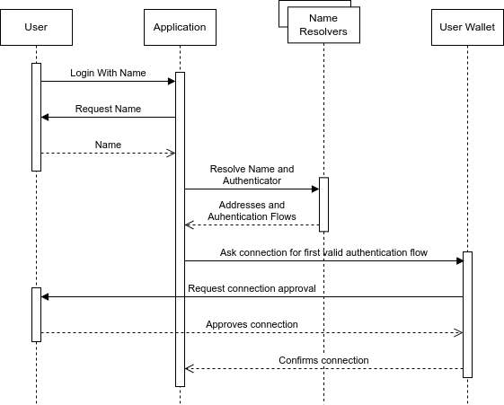

# Abstract

The Domain Wallet Authentication describes a method for linking a crypto domain with authentication methods or providers by adding an authenticator: JSON/URL field to the metadata of a crypto domain NFT.
The standard also describes a method for application developers and web3 login modal providers to enable users to login with their domain name.

The goal of this specification is to define a chain-agnostic identity standard for domain-based authentication.

# Terminology

- Crypto Domain: A domain name that is associated with a blockchain address, typically stored in a blockchain NFT.
- Crypto Domain NFT: A non-fungible token that represents ownership of a crypto domain.
- Wallet Provider: A service that provides wallet functionality, such as signing transactions or messages.
- Text record: A record that stores text-based information, such as an authenticator URL or JSON object.
- Domain lookup/query: The process of retrieving information associated with a domain name, such as an address or text record.
- Authenticator: A URL or JSON object that provides authentication details or additional information related to a domain name.
- Authenticator Flow provider: Any service that will store Authentication Flows linked to Crypto Domains.
- Authentication Flow: Configuration for the requesting application to find and connect to the wallet that it wants to authenticate with.

# Motivation

Current blockchain authentication methods primarily rely on connecting wallets via providers like Metamask.
However, this requires users to remember both their wallet provider and their wallet address.
As more wallets, signers, and chains come online, this problem will only get worse.

Crypto domains provide a human-readable, user-friendly way to represent wallet addresses.
By enabling authentication directly with crypto domains, this standard aims to improve usability and adoption of web3 logins.

Additionally, standardizing the way domain NFT metadata specifies its supported authentication mechanisms allows any compatible domain NFT to abstract out authentication methods and key management.
This abstraction allows both login modals and dApps to easily integrate domain-based logins.

# Specification

## Storage Format

Any system capable of resolving text records can be used for the name in this system.
However, we have chosen to focus this specification on Crypto domain NFTs.
Crypto domain NFTs that are compatible with this authentication standard MUST include an `authenticator` text record entry with the following properties:
- `authenticator` (string, required): An URL that dereferences to a JSON object containing configuration information.
In particular, information about how to authenticate the domain's subject. e.g.

`https://www.authprovider.com/auth/{}`

The application will craft the final URL to get the configuration, where "{}" will be substituted for the user's whole crypto domain name, so for "chrisc.eth" the final URL would be `http://www.authprovider.com/auth/chrisc.eth`

The actual syntax used to store this `authenticator` text record will vary depending on that of the particular Crypto Domain system used.
For example, on ENS, a [ENSIP-5][] record should be created, with a `key` of `authenticator`.
Any relying party can then query the domain for the `authenticator` text record via the [ENSIP-5][] getter interface, i.e. `text(bytes32 node, string key)` where `node` is the ENS domain being queried and `key` is the string "authenticator".

### Example of a request to retrieve the "authenticator" ENS text record:

```typescript
import { normalize } from "viem/ens";
import { publicClient } from "./client";

const userDomain = "chrisc.eth";

const authenticatorRecord = await publicClient.getEnsText({
  name: normalize(userDomain),
  key: "authenticator",
});
// ensText will be 'https://www.authprovider.com/auth/{}'

const authenticationFlowsURL = authenticatorRecord.replace("{}", userDomain);
// authenticationFlowsURL will be 'https://www.authprovider.com/auth/chrisc.eth'
```

## Authentication Flows Retrieval

Having the authentication flows URL, the application can perform an HTTP GET request to it and obtain their configuration.
Application will filter the authentication flows that are not supported and then try to execute in order, passing on the ones that cannot be fulfilled until it finds one that can complete successfully or needs action from the user.

An authentication flow may be unsupported due to the platform it is running mismatching the one it requires, e.g. "browser", "mobile", etc. Or because it requires an specific wallet but it is not installed, e.g. requires "io.metamask" but there is no browser extension wallet.
When an authentication flow requires user action, such as scanning a QR code, or authorizing the connection from the wallet, the application must wait for the user to complete or cancel the action.

## Authentication Flows Definition

The Authentication flows definition JSON MUST conform to the following [Draft 7 JSON Schema][]:

```json
{
  "$schema": "http://json-schema.org/draft-07/schema#",
  "type": "object",
  "properties": {
    "address": {
      "type": "string",
      "description": "The wallet address requested by the user. This can be from any chain and can be an externally owned account or smart wallet"
    },
    "chain": {
      "type": "string",
      "description": "The blockchain id as specified in CAIP-2. This is only required when the wallet is a smart account on a specific chain. If not provided, it is assumed the wallet is an EOA that is not on any chain."
    },
    "authFlows": {
      "type": "array",
      "description": "List of authentication flows supported for different platforms and connections. At least one value must be provided.",
      "items": {
        "type": "object",
        "properties": {
          "platform": {
            "type": "string",
            "description": "The platform type, e.g., 'browser' or 'mobile'. If not specified, it should support all platforms"
          },
          "connection": {
            "type": "string",
            "description": "The method of connection, e.g., 'extension', 'wc' (wallet connect), or 'mwp' (mobile wallet protocol)."
          },
          "URI": {
            "type": "string",
            "description": "The Uniform Resource Identifier used to initiate the authentication process. This can be a URL with an optional domain placeholder, a universal link, a wallet rdns following EIP-6963 or the string 'injected'. E.g., 'io.metamask', 'https://domainwallet.io/wallet', etc. In case this value is not provided it will default according to the application criteria, e.g. looking for an 'injected' wallet in browser"
          }
        },
        "required": ["connection"]
      }
    }
  },
  "required": ["address", "authFlows"]
}
```

Possible values for each field are:

- `platform`:
  - `browser`
  - `mobile`
  - undefined
- `connection`:
  - `extension`, when
  - `wc`, to trigger a connection with the wallet using [Wallet Connect][]
  - `mwp`, to discover and communicate with the wallet usign [Mobile Wallet Protocol][]

Those values are not exhaustive, which means they can be extended as new options arise or become popular.
For example, a new platform such as `wearable` or a new communication protocol could be defined.
This last case will likely happen when smart account wallets or embedded wallets gain enough traction to reach consensus on a standard and become interoperable.

To further clarify how authentication flows should be used, let's consider the following example:

```json
{
  "address": "0xd8da6bf26964af9d7eed9e03e53415d37aa96045",
  "authFlows": [
    {
      "platform": "browser",
      "connection": "extension",
      "URI": "com.wallet.rdns"
    },
    {
      "platform": "mobile",
      "connection": "mwp",
      "URI": "https://universal-link.wallet.com/"
    },
    {
      "connection": "wc",
      "URI": "http://www.wallet.com/auth"
    }
  ]
}
```

To resolve that configuration:

1. Application will iterate the authentication flows, automatically discarding the ones that are not supported until one can be completed or requires user action.
2. First authentication flow indicates that it has to run on `browser`, where there has to be an `extension` wallet installed with the resource identifier `com.wallet.rdns`. When this authentication flow is possible, application will try to trigger the wallet and request a connection using the standard mechanism to communicate with browser extensions wallets.
3. Second authentication flow indicates that it has to run on `mobile`, and using [Mobile Wallet Protocol][] (indicated with the key `mwp`) application has to find another app that responds to the universal link `https://universal-link.wallet.com/`.
4. Last authentication flow does not impose a platform to run on because it does not specify any, so it will be valid everywhere. It tries to set up a [Wallet Connect][] connection to the URI `http://www.wallet.com/auth`. When this authentication flow is triggered, the URI will be opened in a new browser window passing `address`, `domain` and `wcUri` as query params with the resolved address, the domain name and [Wallet Connect][] URI respectively. As this flow requires user action (connecting the wallet at the URI) this step will never be skipped as long as the application supports [Wallet Connect][].

## Standard Authentication Flows

To further clarify different authentication flow configurations we can consider the following cases.

### Use a wallet extension installed at the browser

```json
{
  "platform": "browser",
  "connection": "extension",
  "URI": "io.metamask"
}
```

When using this configuration, the application MUST check available [EIP-6963][] wallets via its signaling channel and trigger the one that matches the URI field with its rdns.
In these cases, the application should not ignore and replace the URI field with any other wallet found in the browser, as it could lead to a security issue where the user connects a wallet that is not the one they want to authenticate with.
Therefore, this configuration will only be valid if the browser has that wallet installed (in this case, Metamask) and be skipped when it is not.

### Use the wallet extension installed at the browser, without requiring a specific one

```json
{
  "platform": "browser",
  "connection": "extension",
  "URI": "injected"
}
```

As this authentication flow calls for the `injected` extension, without specifying which one, it should use the default wallet provider at the browser.
For EVM chains, this would be `window.ethereum`.
Having `connection` set to `extension`, the `URI` field is by default `injected`, so some users might want to skip this field and save some bytes.

However, this configuration is not recommended as having multiple wallets in the browser generates a race condition, and can result in false positives where the wallet used does not have the account linked to the domain.
We recommend using [EIP-6963][] by specifying a wallet rnds in the `URI` field if possible, to avoid this issue.

### Wallet connect to any wallet, letting the user decide upon connection

```json
{
  "connection": "wc"
}
```

Using this configuration, the application should provide the QR code and [Wallet Connect][] URI for the user to connect with his wallet from any place.
Such configuration can be useful when the user has their wallet in their mobile device or on another platform, such as a web wallet or desktop application that can receive the [EIP-1328] URI and present it to the end-user as a "[Wallet Connect]"-style QR code or otherwise get informed consent from the user to make the relay connection; this has the added benefit of allowing a manual choice among multiple wallets at connection time.

This configuration should never be skipped as it does not impose any platform and requires the user action of connecting from the wallet making this a great last case in the `authFlows` array and behaving as the default when no other authentication flow is useful.
The only requirement for this configuration to work is that the application supports [ERC-1328]-conformant relay connections such as [Wallet Connect][].

## Self-hosting Authentication Flows

In case the user does not trust any authentication flow provider to store their info, they can easily host it themselves using a public serverless function and saving its URL in the ENS `authenticator` record.
The requirements for the serverless functions are:
- Being accessible from the internet.
- Being able to return the authentication flows JSON object when requested.
- Provide the user with a way to update the authentication flows in case they want to change them.
- Be able to handle the user's domain name as a parameter to return the correct authentication flows when that changes it.

The user can use any service that provides serverless functions, such as Vercel, AWS Lambda, Google Cloud Functions, etc.
When this is done for personal reasons, the user should be aware that the serverless function will be public and anyone can access it.
Therefore, it is recommended to use a service that provides, at least, rate limiting to avoid abuse.

## Direct Authentication Flows Resolution

There are a few cases where the `authenticator` record can be set to the authentication flows directly.

- The user wants a truly decentralized solution and does not care about the gas cost of storing lots of data in blockchain; then they can write a stringified version of their authentication flows definition in the `authenticator` text record.
- Application will resolve only its issued names, therefore the authentication flows or their location are likely already known. In such cases the application can use its own backend to resolve `authenticator` instead of ENS or another Crypto Domain system NFT system. Responding with the stringified version of the saves the user of the extra request as it does not provide any useful information.

# Login With Name Flow



Web3 applications and login modal providers can implement the Login With Name flow following the sequence pictured in the diagram above:

1. Users starts the Login With Name process.
2. Application requests name and user enters a name linked with the address of the wallet they control and want to authenticate with.
3. Application uses its configured name resolvers to resolves the name authentication flows under the `authenticator` text record.
   If the authenticator text record is a URL, client application sends an HTTP GET request to it in order to obtain users authentication flows.
   This is not needed if the authenticator text record already has a stringified JSON in it.
4. Application filters invalid authentication flows and initiates the one that can be completed which could be by opening a new window in the user's browser to the authenticator URL, triggering the browser wallet, etc.
   If it is not supported due to platform or some other requirement, it can continue with the next one.
5. If no authentication flow can be processed by the application, then display this situation accordingly to the user.
6. Wallet, when needed, will trigger the user for authentication and connection approval before establishing the connection with the wallet.
7. After wallet approves connection, application can match the domain name, the user's wallet address, and an authenticated session to the ones requested previously to validate user is not connecting with another wallet.
8. When everything succeeds, connection should be established between application and the wallet found and triggered under the name provided by the user.

## Connection Properties

How the dApp actually requests signatures and talks to the signer will vary depending on the authenticator and the chain being used.
One option for session management is to create a session with the [CAIP-25][] protocol, where the "authenticated session" token returned is actually a JSON-RPC session token, such as that used by the [Wallet Connect] JSON-RPC relay network.
Applications may also choose to directly integrate signer SDKs, providing a more streamlined signing flow.

For example, here is how an application would integrate with the Login With Name login process:

1. Install connection/authentication libraries, such as [Wagmi][] and [Login With Name WAGMI connector][] packages.
2. Import the connector method from the package (`loginWithName` in the case of `wagmi` and our sample implementation).
3. Configure the macro library (in this case [Wagmi][]) to use the specific connector (`loginWithName`).
   Our sample implementation package provides `ENS` as a name resolver which can be configured to use `mainnet` or `sepolia`.
4. Configure the app to use the previously configured library to establish the connection.
   Following the example would be wrapping the app with `WagmiProvider`, and passing it the configuration with the `loginWithName` connector.
5. Upon connection request, the connector will request application for user name.
   Application can try cached or automatically resolved suggestions first and offer a user confirmation of the suggestion(s), or if none can be resolved without user intervention, prompt the user for a user name directly.
6. Connector will now resolve user name into an address and authentication flows and trying to reach the wallet specified and its accounts.
7. After signing in with the wallet. Application can use the hooks and abstractions provided by the library, such as `useAccount`, `useConnect` etc in the case of `wagmi`.

## Name Resolver Systems

For the purposes of this document, we've detailed a flow based on ENS domains.
But this standard is extensible to any name resolution system.
For example, to use Solana domains, you could just replace the ENS name resolver component with a Solana name resolver component.
The name resolver can also mix several sources, so resolving from several chains (even non-EVM chains) is only a matter of combining the specific name resolver for each chain and then combining them with the necessary logic.

Sample implementation included in [Login With Name WAGMI connector][] include two name resolvers to showcase different implementations.

- ENS, which has wide compatibility with many chains and integrated in many user-facing interfaces across web3.
- Domain Wallets, an online web wallet system compatible with many chains and that already integrates a domain naming system to identify each wallet.
- An application-level multi-resolver, that handles the logic of the two specific resolvers above.

It has to be noted too, that the name resolver can be any service that resolves names and their associated `authenticator` text record to an address and authentication flows respectively.
A name resolver can take any type of name and as long as it can resolve it, it does not have to be tied to any chain.
Also, they can provide their own logic to resolve conflicts where a name exists on different chains or services.
For example, name resolvers could take names from:

- Crypto NFT domain names such as ENS.
- Social networks (facebook, X, Lens, etc.).
- Emails.

And define the order or resolution themselves, totally transparent to the application that uses them.
If the application wants to impose their own logic for resolution over theirs, then it can combine several name resolvers as they all have to adhere to the same interface as shown in the demo.

### Function to resolve a Domain Name to an authenticator URL or JSON

> Function: resolveAuthenticator
> Description: Resolves a given domain name to a URL or a JSON object that can be used for authentication or further information retrieval.
> Input: name (String) - The domain name to be resolved.
> Output: Authenticator (String | JSON | null) - A URL or JSON object providing authentication details or additional information, or null if no data can be found.

This function accepts a domain name as a string and returns a URL or a JSON object.
The output is intended to provide authentication details or additional information related to the domain name.
If no relevant data can be found, the function returns null.
This function should be flexible enough to support different formats and data structures, adapting to the needs of various blockchain platforms and applications.

#### ENS example implementation using Typescript and Viem:

```typescript
import {
  type Address,
  type Chain,
  createPublicClient,
  http,
  PublicClient,
} from "viem";
import { mainnet } from "viem/chains";
import { normalize } from "viem/ens";

export interface NameResolver {
  resolveAuthenticator(name: string): Promise<string | null>;
}

export interface ENSOptions {
  chain?: Chain;
  jsonRpcUrl?: string;
}

export class ENS implements NameResolver {
  private readonly client: PublicClient;

  constructor(options: ENSOptions) {
    this.client = createPublicClient({
      chain: options.chain ?? mainnet,
      transport: http(options.jsonRpcUrl),
    });
  }

  async resolveKey(domainName: string, key: string): Promise<string | null> {
    return this.client.getEnsText({
      name: normalize(domainName),
      key,
    });
  }

  async resolveAuthenticator(domainName: string): Promise<string | null> {
    return this.resolveKey(domainName, "authenticator");
  }
}
```

# Rationale

The Domain Wallet Authentication standard is designed to provide a user-friendly way to authenticate with web3 applications using easy-to-remember names, reducing friction for end-users - especially those that are not familiar with the complexities of blockchain addresses.
By linking a domain name with authentication methods or providers, users can easily log in to web3 applications without having to remember their wallet provider or address.
Specifying the `authenticator` configuration as a domain name NFT text record allows applications to easily discover and integrate with compatible login methods in a standard way.
Having a chain-agnostic standard enables interoperability between different crypto domain providers and authentication methods.
Providing clear wallet implementer steps and code samples makes it easy for developers to adopt this standard.

The standard is designed to not compete with other authentication methods and as an opt-in discovery system that name-controllers can use and applications can trust to automate one friction point in the web3 login process.
It is designed to be flexible, offering options to both consumers at connection time and developers at configuration time.
Additionally, it is designed to be extensible, allowing for new platforms, connections, and name resolvers to be added as they become available and publicly discussed and adopted by the community in followup CAIPs.

# Backwards Compatibility

This standard is fully backwards compatible as it proposes an additional metadata field for crypto domain NFTs.
Existing NFTs and applications will continue to function normally.

## Sample Implementation

A [Wagmi][] connector is published at [Login With Name WAGMI connector][] public repository.
Also, a working demo with further details on how this CAIP works is hosted at [the following link](https://login-with-name-wagmi-sdk.vercel.app/).

## References

- [CAIP-2][] - Chain Agnostic Identity Protocol
- [EIP-1193][] - Ethereum Provider JavaScript API
- [EIP-4361][] - Sign-In with Ethereum
- [EIP-6963][] - Multi Injected Provider Discovery
- [ENSIP-5][] - ENS Text Records
- [Draft 7 JSON Schema][] - Draft 7 JSON Schema
- [Login With Name WAGMI connector][] - Login With Name WAGMI connector
- [Mobile Wallet Protocol][] - Mobile Wallet specification
- [Wagmi][] - Wagmi SDK and docs
- [Wallet Connect][] - Wallet Connect SDK and docs

[CAIP-2]: https://chainagnostic.org/CAIPs/caip-2
[CAIP-25]: https://chainagnostic.org/CAIPs/caip-25
[EIP-1193]: https://eips.ethereum.org/EIPS/eip-1193
[EIP-1328]: https://eips.ethereum.org/EIPS/eip-1328
[EIP-4361]: https://eips.ethereum.org/EIPS/eip-4361
[EIP-6963]: https://eips.ethereum.org/EIPS/eip-6963
[ENSIP-5]: https://docs.ens.domains/ensip/5
[Login With Name WAGMI connector]: https://github.com/FedericoAmura/login-with-name-wagmi-sdk
[Draft 7 JSON Schema]: http://json-schema.org/draft-07/schema#
[Mobile Wallet Protocol]: https://mobilewalletprotocol.github.io/wallet-mobile-sdk/
[Wagmi]: https://wagmi.sh/
[Wallet Connect]: https://walletconnect.com/

# Copyright

Copyright and related rights waived via [CC0](https://github.com/ChainAgnostic/CAIPs/blob/main/LICENSE).
