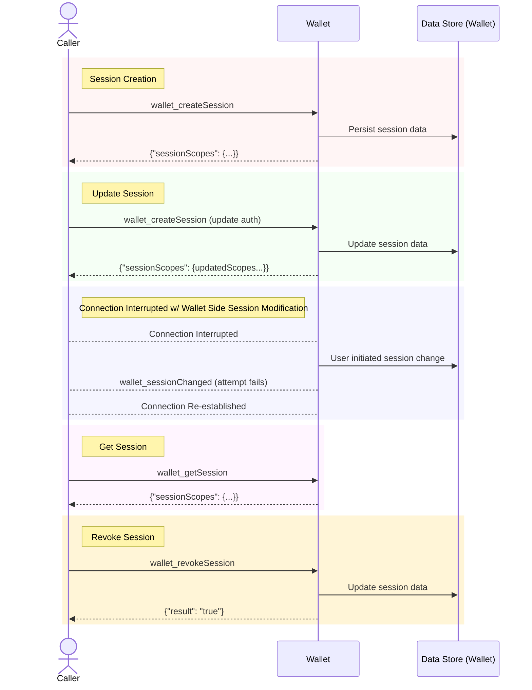

## Simple Summary

This overview compares new and old forms of [CAIP-25][] connection flow to ensure safe and well-informed implementation of either or both.
[CAIP-311][] and [CAIP-312][] extended [CAIP-25][] by defining new JSON-RPC methods for managing the lifecycle of authorizations within a session.
These methods allow dapps and wallets to dynamically adjust authorizations, providing more granular control and better user experience.
Additionally, it allows for session management without mandatory [sessionIds][CAIP-171], offering more flexibility in handling sessions in single-session contexts.

## Abstract

By loosening the earlier requirement that both caller and wallet maintain a session identifier to track the session across potentially shared or insecure transports, single-session transport options can take advantage of direct RPC calls to do more explicit session-management.

## Motivation

The equivalence across different transports can be counter-intuitive, so the following diagrams and examples are provided for apples-to-apples comparisons.

## Lifecycle Equivalence Chart

||feature|CAIP-25 now w/ sessionId|CAIP-285 w/o sessionId|
|---|---|---|---|
|1|dapp initialize (replaces session if already exist)|call [`wallet_createSession`][CAIP-25] w/o sessionId |call `wallet_createSession` w/o sessionId|
|2|wallet re-initialize|return `wallet_createSession` w/ new sessionId **next time called**|n/a (not needed because [`wallet_sessionChanged`][CAIP-311] notification can be sent, and [`wallet_getSession`][CAIP-312] can be used to confirm everything is good)|
|3|dapp get current session|n/a (should persist)|`wallet_getSession` w/o sessionId|
|4|dapp confirm current session|call `wallet_createSession` w/ sessionId and same properties OR `wallet_getSession` w/ sessionId|`wallet_getSession` w/o sessionId|
|5|dapp revoke|call `wallet_createSession` w/o sessionId and no scopes OR [`wallet_revokeSession`][CAIP-285] w/ sessionId |`wallet_revokeSession`  w/o sessionId|
|6|wallet revoke|return `wallet_createSession` w/ new sessionId and no scopes **next time called** or `wallet_sessionChanged` w/ sessionId |`wallet_sessionChanged`  w/o scopes|
|7|dapp update session|call `wallet_createSession` w/existing sessionId and new scopes|call `wallet_createSession` w/o sessionId|
|8|wallet update session|return `wallet_createSession` w/ new sessionId and no scopes **next time called** OR `wallet_sessionChanged` w/existing sessionId|`wallet_sessionChanged` w/o sessionId|

## Lifecycle diagrams

### Visualizing the lifecycle of a session without a `sessionId`



### Visualizing the lifecycle of a session **with** a `sessionId`

```mermaid
sequenceDiagram
  rect rgb(255, 255, 255)
  participant CallerDataStore as Data Store (Caller)
  actor Caller
  participant Wallet
  participant WalletDataStore as Data Store (Wallet)
  rect rgb(255, 245, 245)
  note right of Caller: Session Creation
  Caller->>Wallet: wallet_createSession
  Wallet->>WalletDataStore: Persist session data
  Wallet-->>Caller: {"sessionId": "0xdeadbeef", "sessionScopes": {...}}
  Caller->>CallerDataStore: Persist session data
  end
  rect rgb(245, 255, 245)
  note right of Caller: Update Session
  Caller->>Wallet: wallet_createSession (sessionId: 0xdeadbeef, {updatedScopes...})
  Wallet->>WalletDataStore: Update session data
  Wallet-->>Caller: {"sessionId": "0xdeadbeef", "sessionScopes": {(updated)sessionScopes...}}
  Caller->>CallerDataStore: Persist session data
  end
  rect rgb(245, 245, 255)
  note right of Caller: User Initiated Session Change
  Wallet->>WalletDataStore: User initiated session change
  Wallet->>Caller: wallet_sessionChanged (sessionId: 0xdeadbeef)
  Caller->>CallerDataStore: Update session data
  end
  rect rgb(255, 245, 255)
  note right of Caller: Revoke Session
  Caller->>Wallet: wallet_createSession (sessionId: 0xnewbeef, no scopes)
  Wallet->>WalletDataStore: Create new, empty session 0xnewbeef ; clear all older sessions w/same dapp
  Wallet-->>Caller: {"result": "true"} (session is revoked)
  Caller->>CallerDataStore: Clear session data
  end
  rect rgb(255, 245, 255)
  note right of Caller: Revoke Session (alternate)
  Caller->>Wallet: wallet_revokeSession (sessionId: 0xdeadbeef)
  Wallet->>WalletDataStore: Update session data
  Wallet-->>Caller: {"result": "true"} (session is revoked)
  Caller->>CallerDataStore: Update session data
  end
  end
```
## Privacy Considerations

The introduction of this lifecycle method must ensure that only authorized parties can retrieve the authorizations of a session. Proper authentication and authorization mechanisms must be in place to prevent unauthorized access or modifications.

To achieve this, it is recommended to establish a connection over domain-bound or other 1:1 transports. Where applicable, additional binding to a `sessionId` is recommended to ensure secure session management. This approach helps to create a secure communication channel that can effectively authenticate and authorize session-related requests, minimizing the risk of unauthorized access or session hijacking.
## Changelog

- 2024-06-07: Initial draft of CAIP-285.

## Links


- [CAIP-25][] - Session handshake - `wallet_createSession` - specification
- [CAIP-171][] - Session Identifier, i.e. syntax and usage of `sessionId`s
- [CAIP-217][] - Authorization Scopes, i.e. syntax for `scopeObject`s
- [CAIP-285][] - `wallet_revokeSession` Specification
- [CAIP-312][] - `wallet_getSession` Specification
- [CAIP-311][] - `wallet_sessionChanged` Specification

[CAIP-25]: https://chainagnostic.org/CAIPs/caip-25
[CAIP-171]: https://chainagnostic.org/CAIPs/caip-171
[CAIP-217]: https://chainagnostic.org/CAIPs/caip-217
[CAIP-285]: https://chainagnostic.org/CAIPs/caip-285
[CAIP-312]: https://chainagnostic.org/CAIPs/caip-312
[CAIP-311]: https://chainagnostic.org/CAIPs/caip-311

## Copyright

Copyright and related rights waived via [CC0](../LICENSE).
