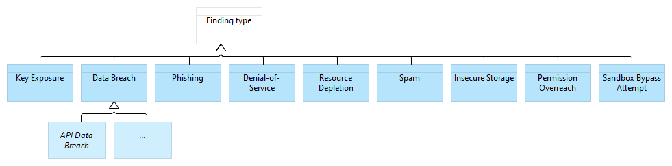

---
# Every document starts with a front matter in YAML enclosed by triple dashes.
# See https://jekyllrb.com/docs/front-matter/ to learn more about this concept.
caip: CAIP-x
title: Community-Powered Trust Assessment
author: Dayan | dayan.fc | dayan.lens | dayanx.eth | (@dayksx) <dayksx@protonmail.com>
discussions-to: <URL(s); if multiple, list separated by , without " or []> 
status: Draft
type: Standard
created: 2023-11-21
updated: 2023-11-21
requires: CAIP-261 
---

## Simple Summary

CAIP-x defines a way to assess trust in discreet resources (e.g. software components, packages, documents, etc.) by leveraging community claims and pulling in trust data from social graphs and webs of trust.

## Abstract

This proposal introduces a standardized data framework with the aim to propose lightweight interfaces for:

1. claims made by actors in an open, peer-to-peer network about discreet resources (software components in all the examples that follow),
2. claims made by these actors about each other,
3. community-derived trust scores for the discreet resources and/or actors.

These three data elements can be used independently of one another.
For building a community-powered trust assessment mechanism, it's necessary to identify and gather the relevant data in accordance with the requirements of the intended trust scores computation.
These data can then be leveraged to compute synthetic trust scores which reflect the overall sentiment of the community.

The data framework modeled below incorporates the following basic primitives as inputs:

- **Peer Trust Assertion:** This allows individuals to define their trusted peers, shaping their trust graph (cf. CAIP-261 Web of Trust Primitives);
- **Expert Report Assertion:** This enables experts to publish insights and conclusions about a given resource (e.g. an audit in the case of software components);
- **Peer Review Assertion:** This allows individuals to endorse or dispute claims made about resources by peers;
- **Resource Trust Score:** This enables any trust computer to publish computed trust scores about resources and/or about the actors behind the other 3 primitives.

The peer-to-peer actor model described here operated on explicit trust signals, but is intended for contexts where actors are long-lived and public identifiers (such as a blockchain environment), such that trust assessments can be supplemented with more implicit on-chain and/or off-chain trust signals associated with its actors, such as `Proof of Humanity`, `Proof of Membership`, `Proof of Contributions`, `Proof of Attendences`, `Social Graphs`, and more.

While the trust-data input model is fairly general, the prototyping work to date has been focused on the software components associated with a blockchain-centric software environment, where actor identification and data formats tend to be relatively easy to connect into a graph.
Categories of discreet software resources we imagine this could be useful to describe include:

- self-custodial wallets (like MetaMask)
- wallet extensions (such as Snaps)
- decentralized network clients (for instance, Geth and other blockchain clients)
- smart contracts or other onchain compiled artefacts
- web-based decentralized applications for interacting with on-chain artefacts

## Motivation
<!--The motivation is critical for CAIP. It should clearly explain why the state of the art is inadequate to address the problem that the CAIP solves. CAIP submissions without sufficient motivation may be rejected outright.-->

Software components within a decentralized web tend to be distributed permissionlessly.
While this fosters permissionless innovation, it simultaneously exposes the system to potential vulnerabilities and scams, for lack of open trust and reputation mechanisms.
Most existing solutions for evaluating software components are centralized, necessitating trusted intermediaries.
This reliance on trusted intermediaries near the edges compromises the decentralized properties of the core of the ecosystem.
By standardizing data to form a universally applicable trust graph reusable across layers of the system, we strengthen the reliability of software components assessments powered by communities.

## Specification

### Identifier Scheme

The flexibility of the system requires stable and translatable identifiers for both actors and resources.
We chose to identify all actors (including software actors like trust computers or oracles) by [Decentralized Identifiers][DID] and all static resources (as well as the claims, trust assertions, and other data points) by [Content Identifiers][CID].

Our data framework has been prototyped to use the following identifiers, although other systems might apply additional identifier and serialization schemes:

- **Peers:** cf. CAIP-261 Web of Trust primitive

- **Resources:** Custom identifiers were used per category of software components, such as checksum for specific builds/binaries (e.g. `snap://<checksum>`) and onchain addresses for deployed smart contracts (e.g. _ `did:pkh:eip155:1:<contractAddress>`
- **Assertions:** Documents like those defined and excerpted below were encoded as JSON and canonicalized according to the [JSON Canonicalization Scheme][JCS] before being serialized as a [multihash][] with a ["raw JSON" prefix][multicodec-json] to be stored in a IPFS-style syncing-friendly, [CID-queryable][CID] key/value store.
- **Software entities:** Our prototype addressed all offchain entities that produce or consume trust assertions by `did:key` public-key identifiers to simplify mutual authentication and data authentication, and all onchain entities by `did:pkh` for the addresses to which they were deployed.

### Data Model

A peer can issue assertions about the following subjects:

- Another peer, by issuing **Trust** assertions,
- A Software component, by issuing **Security Report** or **Review** assertions,
- A Security report, by issuing **Review** assertions.


#### Software component Trust Assessment Metamodel

All subsequent documents adhere to the [Verifiable Credential Data Model](https://www.w3.org/TR/vc-data-model/) for representation purposes.
However this standard does not prescribe any specific document type, even though internationally recognized standards are recommended.
The standard presumes that both the `issuer` property will be dereferenced and the complete contents of the `credentialSubject` will be consumed only after the wire-formats and signed-envelopes have been verified.

#### Incoming Data: Trust signals

**Peer trust assertion:**
cf. CAIP-261 Web of Trust primitive


##### Scope of Trust Data Model

Example security audit report about a specific software component:

```json
"id": "QmPTqvH3vm6qcZSGqAUsq78MQa9Ctb56afRZg1WJ5sKLiu",
"type": ["VerifiableCredential", "SecurityReportCredential"],
"issuanceDate": "2024-02-15T07:05:56.273Z",
"issuer": "did:pkh:eth:0x44dc4E3309B80eF7aBf41C7D0a68F0337a88F044",
"credentialSubject":
{
  "id": "snap://CLwZocaUEbDErtQAsybaudZDJq65a8AwlEFgkGUpmAQ=",
  "securityStatus": "Unsecured",
  "securityFindings": [
    {
      "criticality": 1,
      "type": "Key leak",
      "description": "`snap_getBip44Entropy` makes the parent key accessible"
      "lang": "en"
    },
    {
      "criticality": 0.5,
      "type": "Buffer Overflow"
    },
    {
      "criticality": 0.25,
      "type": "Phishing"
    },
    {
      "criticality": 0,
      "type": "Data leak",
      "description": "API can communicate data to a centralized server"
    },
  ]
},
"proof": {}
```

Security report with no findings:

```json
"type": ["VerifiableCredential", "SecurityReportCredential"],
"issuanceDate": "2024-02-15T07:05:56.273Z",
"issuer": "did:pkh:eth:0x44dc4E3309B80eF7aBf41C7D0a68F0337a88F044",
"credentialSubject":
{
  "id": "snap://CLwZocaUEbDErtQAsybaudZDJq65a8AwlEFgkGUpmAQ=",
  "securityStatus": "Secured"
},
"proof": {}
```

- The `securityStatus` is the final result of the security assessment, that can be either `Secured` or `Unsecured`.
- The `findings` (optional) lists the security findings.
- The `criticality` of findings must remain within the following range: [0,1]; This could be interpreted as follows: `None` (0), `Low` (0.25), `Medium` (0.5), `High` (0.75), `Critical` (1).

This standard introduce the folowing references findings: `Key Exposure`, `Data Breach`, `Phishing`.
As with the trust scopes, these finding types are not prescriptive, but arbitrary examples are given to serve as guidance to achieve higher interoperability.
They can be augmented or extended by inheriting high-level findings to accomodate any use-case.



###### Expert Report Types

Review of a Security Report:

Reviews are used to express an opinion on any subject, such as a security report.

```json
"type": ["VerifiableCredential", "ReviewCredential"],
"issuanceDate": "2024-02-15T07:05:56.273Z",
"issuer": "did:pkh:eth:0x44dc4E3309B80eF7aBf41C7D0a68F0337a88F044",
"credentialSubject":
{
  "id": "QmPTqvH3vm6qcZSGqAUsq78MQa9Ctb56afRZg1WJ5sKLiu",
  "currentStatus": "Disputed",
  "reason": ["Missed Vulnerability"],
},
"proof": {}
```

```json
"type": ["VerifiableCredential", "ReviewCredential"],
"issuer": "did:pkh:eth:0x44dc4E3309B80eF7aBf41C7D0a68F0337a88F044",
"credentialSubject":
{
  "id": "d6f7052b6f28912f2703066a912ea577f2ce4da4caa5a5fbd8a57286c345c2f2",
  "currentStatus": "Endorsed"
},
"proof": {}
```

Review of a Software Component:

Reviews can also be used directly on a software component to provide a non technical review.

```json
"type": ["VerifiableCredential", "ReviewCredential"],
"issuanceDate": "2024-02-15T07:05:56.273Z",
"issuer": "did:pkh:eth:0x44dc4E3309B80eF7aBf41C7D0a68F0337a88F044",
"credentialSubject":
{
  "id": "snap://CLwZocaUEbDErtQAsybaudZDJq65a8AwlEFgkGUpmAQ=",
  "currentStatus": "Disputed",
  "reason": ["Scam", "Phishing"]
},
"proof": {}
```

```json
"type": ["VerifiableCredential", "ReviewCredential"],
"issuanceDate": "2024-02-15T07:05:56.273Z",
"issuer": "did:pkh:eth:0x44dc4E3309B80eF7aBf41C7D0a68F0337a88F044",
"credentialSubject":
{
  "id": "snap://CLwZocaUEbDErtQAsybaudZDJq65a8AwlEFgkGUpmAQ=",
  "currentStatus": "Endorsed",
  "reason": ["User-Friendly", "Usefull", "Seems secured"]
},
"proof": {}
```

- `currentStatus`: This defines the review status, that can be either `Disputed` or `Endorsed`.
- `reason` (optional): This defines the reason for a given review status.

#### Outgoing data: Trust score

Please note that the method for calculating the trust scores is entirely open, and this standard does not provide specific guidelines for it.

The trust signals (incoming data) are leveraged to calculate the trust scores (outgoing data) for peers and software components.
While the computation steps may vary based on the chosen trust score computation, the following main steps give an idea of some generic processing logic from a given peer point of view:

1. Retrieve the peers (directly and indirectly connected peers that have issued reviews, security reports of the given software component),
2. Calculate the peers' trust scores (relatively to the requesting peer's point of view),
3. Weight the reviews (endorsements and disputes) based on the issuers' peers scores,
4. Weight the security reports based on the weight of the endorsements and disputes as well as the issuers' peers scores;
5. Calculate the software component's trust score based on the weight of the security reports, and if available, the software component's developers peer trust score.

Resource Trust Score:

```json
"type": ["VerifiableCredential", "ResourceTrustScoreCredential"],
"issuanceDate": "2023-11-24T12:24:42Z",
"issuer": "did:pkh:eip155:1:0x23d86aa31d4198a78baa98e49bb2da52cd15c6f0",
"credentialSubject":
{
  "id": "snap://CLwZocaUEbDErtQAsybaudZDJq65a8AwlEFgkGUpmAQ=",
  "trustScore": {
    "confidence": 0.0555555559694767,
    "value": 1
  },
  "trustScoreType": "IssuerTrustWeightedAverage"
},
"proof": {}
```

### Data and Trust Score Storage

Please note that the storage of assertions is entirely open, and this standard does not provide specific guidelines for it.

Incoming and outgoing data can be stored in any datastore, but we recommend some minimal requirements for verifiability and sustainability:

- Data availability: The datastore should make the assertions and proofs publicly available for consumption and verification purposes;
- Tamper-proof: The datastore should provide assertion data with proofs of completeness, ensuring that none have been altered or obstructed them;
- Scalability: The datastore should scale to meet the evolving demand of issued assertions.

## Rationale

### Modularity and extensibility

The standard has been designed with modularity and solution-agnosticism, to maximize flexibility and reusability:

- Data elements are independent from each other, allowing for the use of only a subset of it,
- The data framework is agnostic to any specific trust computer, enabling any trust score computation logic,
- Flexible data ranges leveraging floats type facilitating the creation of tailored user experiences,
- Data structures has been designed to be agnostic, enabling the reusability of the data across different use-cases.

### Identification

[DID][]s and [CID][] are decentralized identification methods that are not reliant on any centralized identity provider, making them more sustainable.

1. [Decentralized identifiers][DID] using the `pkh` and `key` methods allow for the identification of account owners or trust computers in a chain-agnostic manner without the complexity of on-chain resolution.
2. [Content Identifiers][CID] enable anyone to deterministically generate identifiers based on the canonicalized content of a given JSON document, and store it in a compact, tamper-evident way conducive to merging, syncing, or even CRDT patterns.

### Data

3. The security of software components is assessed based on findings from security reports,
4. The security reports can be approved or challenged by the community, through endorsement and dispute form community,

## Test Cases

## Security Considerations

## Privacy Considerations
<!--Please add an explicit list of intra-actor assumptions and known risk factors if applicable. Any normative definition of an interface requires these to be implementable; assumptions and risks should be at both individual interaction/use-case scale and systemically, should the interface specified gain ecosystem-namespace adoption. -->
Issuing assertions makes public the opinion of issuers (identified by their public address), and therefore should be informed about the consequence of their action.

## References
<!--Links to external resources that help understanding the CAIP better. This can e.g. be links to existing implementations. See CONTRIBUTING.md#style-guide . -->

- [CAIP-1][CAIP-1] defines the CAIP document structure

[CAIP-1]: https://ChainAgnostic.org/CAIPs/caip-1
[DID]: https://www.w3.org/TR/did-core/
[CID]: https://github.com/multiformats/cid
[did:pkh]: https://github.com/w3c-ccg/did-pkh/blob/main/did-pkh-method-draft.md
[multihash]: https://github.com/multiformats/multihash
[multicodec-json]: https://github.com/multiformats/multicodec/blob/master/table.csv#L138
[JCS]: <https://www.rfc-editor.org/rfc/rfc8785>

## Copyright

Copyright and related rights waived via [CC0](../LICENSE).
