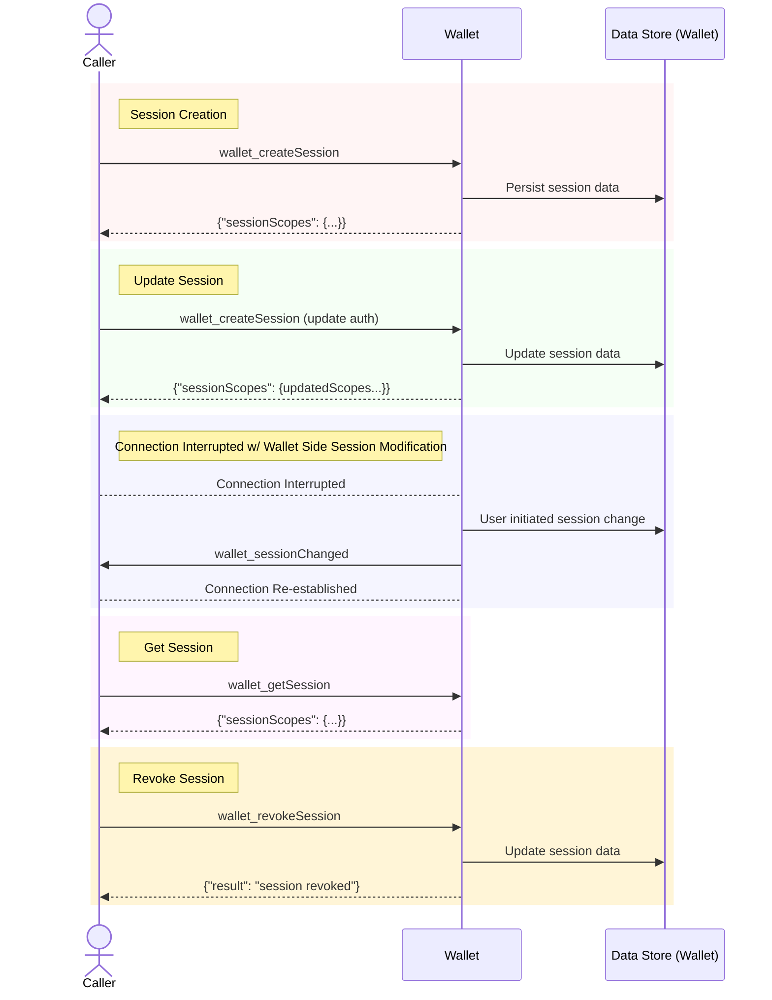
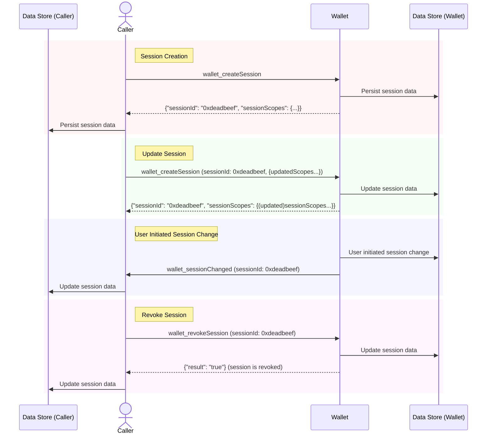

## Simple Summary

This backwards-compatible extension of the CAIP-25 standard defines new JSON-RPC methods for managing the lifecycle of authorizations within a session.
These methods allow dapps and wallets to dynamically adjust authorizations, providing more granular control and better user experience.
Additionally, it allows for session management without mandatory sessionIds, offering more flexibility in handling sessions in single-session contexts.

## Abstract

This proposal aims to extend the CAIP-25 standard by defining new JSON-RPC methods for managing the lifecycle of authorizations within a session. These methods allow dapps and wallets to dynamically adjust authorizations, providing more granular control and better user experience. Additionally, it allows for session management without mandatory sessionIds, offering more flexibility in handling sessions.

## Motivation

The motivation behind this proposal is to enhance the flexibility of CAIP-25 by enabling management of session authorizations without sessionIds which don't map well to extension based wallet's dapp connections and could therefore add constraints and burdens to existing flows. The proposed methods provide an intuitive way to add, revoke, and retrieve authorizations within an existing session, simplifying the management of session lifecycles.

### Use Case Scenarios

1. **Wallet Initiated Adding Authorizations To an Existing Session:**

   - **Current Method:** CAIP-25 does not make it very clear how a respondent (wallet), can modify the authorizations of an existing session. The following excerpt is the closest we get: "The properties and authorization scopes that make up the session are expected to be persisted and tracked over time by both parties in a discrete data store, identified by an entropic identifier assigned in the initial response. This object gets updated, extended, closed, etc. by successive calls and notifications, each tagged by this identifier."
   - **Proposed Method:** Wallet publishes and caller/dapp listens for an event `wallet_sessionChanged` with the new full sessionScope.

2. **Wallet Initiated Authorizations Revocation:**

   - **Current Method:** "If a respondent (e.g. a wallet) needs to initiate a new session, whether due to user input, security policy, or session expiry reasons, it can simply generate a new session identifier to signal this notification to the calling provider."
   - Given this language it is unclear if a wallet can revoke authorizations without creating a new session. It is also therefore unclear if a wallet can revoke some subset of authorizations without creating a new session.
   - **Proposed Method:** Wallet publishes and caller/dapp listens for an event `wallet_sessionChanged` with the new full sessionScope.

3. **Dapp Initiated Authorizations Revocation:**

   - **Current Method:** "if a caller [dapp] needs to initiate a new session, it can do so by sending a new request without a sessionIdentifier."
   - **Proposed Method:** Use `wallet_revokeSession` to revoke an entire existing session. When a `sessionId` is passed as a parameter the request revokes that particular session, otherwise it revokes the single active session between wallet and caller.

4. **Retrieving Current Session Authorizations:**

   - **Current Method:** Wallet and app both persist configuration across updates.
   - **Proposed Method:** Use `wallet_getSession` to retrieve the current authorizations of the session.

## Equivalence Chart

||feature|CAIP-25 now w/sessionId|CAIP-285 w/o sessionId|
|---|---|---|---|
|1|dapp initialize (replaces session if already exist)|call `wallet_createSession` w/no sessionId |call `wallet_createSession` w/no sessionId|
|2|wallet re-initialize|return `wallet_createSession` w/new sessionId **next time called**|n/a (not needed because `wallet_sessionChanges` notif can be sent, and wallet_getSession can be used to confirm everything is good)|
|3|dapp get current session|n/a (should persist)|`wallet_getSession`  w/o sessionId|
|4|dapp confirm current session|call `wallet_createSession` w/sessionId and same properties OR `wallet_getSession` w/sessionId|`wallet_getSession` w/o sessionId|
|5|dapp revoke|call `wallet_createSession` w/no sessionId and no scopes OR `wallet_revokeSession` w/sessionId |`wallet_revoke`  w/o sessionId|
|6|wallet revoke|return `wallet_createSession` w/new sessionId and no scopes **next time called** or `wallet_sessionChanged` w/ sessionId |`wallet_sessionChanged`  w/no scopes|
|7|dapp update session|call `wallet_createSession` w/existing sessionId and new scopes|call `wallet_createSession` w/no sessionId|
|8|wallet update session|return `wallet_createSession` w/new sessionId and no scopes **next time called** OR `wallet_sessionChanged` w/existing sessionId|`wallet_sessionChanged` w/o sessionId|

## Specification

### New Methods

#### `wallet_revokeSession`

Revokes authorizations for an active session.

**Parameters:**

- `sessionId` (string, optional): The session identifier.

**Initial Session Scopes:**

```json
{
  "eip155:1": {
    "methods": ["eth_signTransaction", "eth_sendTransaction"],
    "notifications": ["accountsChanged", "chainChanged"],
    "accounts": ["eip155:1:0xabc123", "eip155:1:0xdef456"]
  },
  "eip155:137": {
    "methods": ["eth_sendTransaction"],
    "notifications": ["chainChanged"],
    "accounts": ["eip155:137:0xdef456"]
  }
}
```

**Example Request:**

```json
{
  "id": 1,
  "jsonrpc": "2.0",
  "method": "wallet_revokeSession",
  "params": {}
}
```

**Example Response:**

```json
{
  "id": 1,
  "jsonrpc": "2.0",
  "result": {
    "success": true
  }
}
```

#### `wallet_getSession`

Retrieves the current authorizations of an existing session.

**Parameters:**

- `sessionId` (string, optional): The session identifier.

**Initial Session Scopes:**

```json
{
  "eip155:1": {
    "methods": ["eth_signTransaction"],
    "notifications": ["accountsChanged"],
    "accounts": ["eip155:1:0xabc123"]
  },
  "eip155:137": {
    "methods": ["eth_sendTransaction"],
    "notifications": ["chainChanged"],
    "accounts": ["eip155:137:0xdef456"]
  }
}
```

**Example Request:**

```json
{
  "id": 1,
  "jsonrpc": "2.0",
  "method": "wallet_getSession",
  "params": {}
}
```

**Example Response:**

```json
{
  "id": 1,
  "jsonrpc": "2.0",
  "result": {
    "scopes": {
      "eip155:1": {
        "methods": ["eth_signTransaction"],
        "notifications": ["accountsChanged"],
        "accounts": ["eip155:1:0xabc123"]
      },
      "eip155:137": {
        "methods": ["eth_sendTransaction"],
        "notifications": ["chainChanged"],
        "accounts": ["eip155:137:0xdef456"]
      }
    }
  }
}
```

**Explanation:**

- The `wallet_getSession` method returns the current authorizations for the session. It lists all scopes along with their methods, notifications, and accounts.

### Events

#### `wallet_sessionChanged`

This event is published by the wallet to notify the caller/dapp of updates to the session authorization scopes. The event payload contains the new `sessionScopes objects`. If a connection between the wallet and the caller/dapp is severed and the possiblity of missed events arises, the caller/dapp should immediately call `wallet_getSession` to retrieve the current session scopes.

**Event Payload:**

- `sessionId` (string, optional): The session identifier.
- `sessionScopes` (object of `scopeObject` objects, required): An object containing the updated session scopes, formatted according to CAIP-217.

**Initial Session Scopes:**

```json
{
  "sessionScopes": {
    "eip155:1": {
      "methods": ["eth_signTransaction"],
      "notifications": ["accountsChanged"],
      "accounts": ["eip155:1:0xabc123"]
    },
    "eip155:137": {
      "methods": ["eth_sendTransaction"],
      "notifications": [],
      "accounts": ["eip155:1:0xabc123", "eip155:137:0xdef456"]
    }
  }
}
```

**Example Event:**

```json
{
  "method": "wallet_sessionChanged",
  "params": {
    "sessionScopes": {
      "eip155:1": {
        "methods": ["eth_signTransaction", "eth_sendTransaction"],
        "notifications": ["accountsChanged"],
        "accounts": ["eip155:1:0xabc123"]
      },
      "eip155:137": {
        "methods": ["eth_sendTransaction"],
        "notifications": [],
        "accounts": ["eip155:137:0xdef456"]
      }
    }
  }
}
```

This event indicates how the scopes have changed by comparing the updated scopes with the initial session scopes. In the example, the method `eth_sendTransaction` was added to `eip155:1`, and the account `eip155:1:0xabc123` was removed from `eip155:137`.

### Optional SessionIds

The `sessionId` parameter in the new lifecycle methods is optional. When not provided, the methods will operate on the current active session. This approach allows for more flexible session management without the overhead of tracking session identifiers.

## Lifecycle diagrams

### Visualizing the lifecycle of a session without a `sessionId`



### Visualizing the lifecycle of a session **with** a `sessionId`



## Security Considerations

The introduction of these lifecycle methods must ensure that only authorized parties can modify the authorizations of a session. Proper authentication and authorization mechanisms must be in place to prevent unauthorized access or modifications.

## Privacy Considerations

Managing authorizations within an existing session reduces the need to create multiple session identifiers, which can help minimize the exposure of session-related metadata.

## Changelog

- 2024-06-07: Initial draft of CAIP-285.

## Links

- [CAIP-25](https://chainagnostic.org/CAIPs/caip-25)
- [CAIP-217](https://chainagnostic.org/CAIPs/caip-217)

## Copyright

Copyright and related rights waived via [CC0](../LICENSE).
